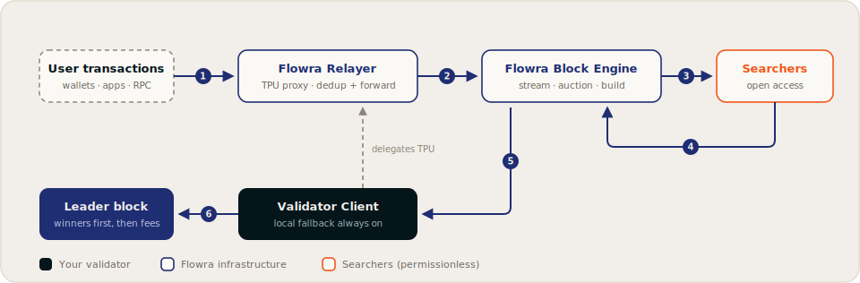

# Architecture

Flowra is built from three components: the **Validator Client**, the **Relayer**, and the **Block Engine**. Together they sit between incoming transaction flow and the validator's block production.

## System overview

## Components

Component | Role
--- | ---
**Flowra Validator Client** | A validator client built on the Jito-Solana codebase. It delegates its TPU ports to the Relayer, receives winning bundles from the Block Engine, runs the local policy check, and always retains full local block production.
**Flowra Relayer** | A TPU proxy that receives transactions on the validator's behalf. It authenticates the validator, deduplicates and batches incoming packets, and forwards them to the Block Engine and the validator.
**Flowra Block Engine** | The heart of the system. It broadcasts the orderflow stream to subscribed searchers, accepts and validates bundle submissions, runs the 50&nbsp;ms conflict-aware auctions, and forwards winning bundles to the leader.

Searchers connect to the Block Engine from the outside: they subscribe to the orderflow stream and submit tip-bearing bundles through the same service. See [Searchers](../searchers/index.md).

## Transaction flow, step by step

1. **Arrival.** User transactions reach the Relayer, which fronts the validator's TPU ports.
2. **Forwarding.** The Relayer deduplicates the flow and forwards packets to the Block Engine and the validator.
3. **Broadcast.** The Block Engine streams the flow to all subscribed searchers over gRPC.
4. **Bidding.** Searchers detect opportunities and submit tip-bearing bundles back to the Block Engine.
5. **Auction and delivery.** Every 50&nbsp;ms the Block Engine simulates candidate bundles, drops any that revert, closes the auction round, and selects the optimal non-conflicting, highest-tip set within the policy constraints the validator pushed.
6. **Inclusion.** The validator's BundleStage executes winning bundles atomically and places them first in the block, within a reserved compute budget. Remaining space fills under standard fee rules.

## Failure behavior: the validator never depends on Flowra

The design constraint that shapes everything above: **a Flowra validator must never need Flowra to produce a block.**

- If the Relayer becomes unreachable, the validator reclaims its TPU ports and receives transactions directly, exactly as a stock validator does.
- If the Block Engine degrades, the validator simply stops receiving bundle sets and continues producing blocks with its standard in-client scheduling.
- Bundle inclusion is additive revenue, not a dependency. Participation never puts a leader slot at risk.

!!!success Operational guarantee
Flowra is a policy-and-revenue layer on top of block production, never a gatekeeper in front of it.
!!!

## Where policy fits

The [Programmable Block Policy](programmable-block-policy.md) follows an authority-push model:

1. **The validator owns the policy.** It lives as a TOML file on the validator's machine, and the client pushes it to the Block Engine on connect (and again automatically whenever the file changes).
2. **The Block Engine enforces it before the auction.** Non-conforming bundles are filtered out before selection, so they never compete for the validator's blocks.

## Trust boundaries

- **Searchers never see each other's bundles.** Submissions go point-to-point to the Block Engine; strategy confidentiality is preserved even though the orderflow stream itself is open.
- **Validators set the rules for their own auction.** The policy the engine enforces is the policy the validator pushed, and every push and rejection is logged.
- **The stream is the same for everyone.** All searchers subscribe through one interface, with no privileged feeds.

[!ref Validator setup guide](../validators/getting-started.md)
[!ref Searcher integration guide](../searchers/getting-started.md)
