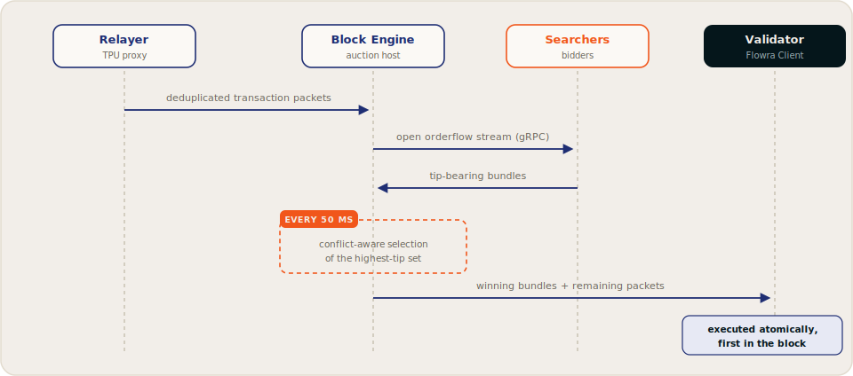
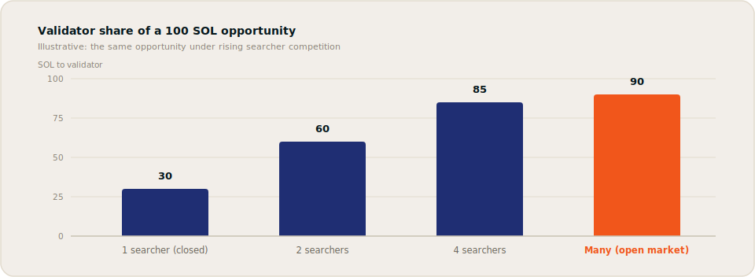

# Auction Mechanics

Flowra runs a continuous sequence of **50&nbsp;ms mini-auctions** aligned with Solana's continuous block production. This page explains the auction lifecycle, the selection rules, and why open competition raises validator revenue.

## The auction lifecycle

1. The Relayer forwards deduplicated transaction packets to the Block Engine.
2. The Block Engine broadcasts the flow to all subscribed searchers over gRPC.
3. Searchers detect opportunities and submit **tip-bearing bundles**.
4. The Block Engine simulates each bundle against recent state, dropping any that revert or misreport their tip, and applies the validator's [block policy](programmable-block-policy.md).
5. Every 50&nbsp;ms an auction tick closes: the highest-tip, non-conflicting set wins and is forwarded to the leader, where it lands **first** in the block. Remaining block space fills under standard fee rules.

### Why 50 ms?

Solana produces a block every ~400&nbsp;ms, continuously. A 50&nbsp;ms cadence fits multiple competitive cycles inside every slot, up to eight auction rounds per block, so opportunities are contested close to the moment they appear rather than batched into one coarse round. Short windows also blunt pure latency racing: within a window, the *tip* decides, not the microsecond of arrival.

## Selection rules

### Highest tip wins, among non-conflicting bundles

Bundles are ranked by tip. But two bundles that touch the same accounts in incompatible ways cannot both execute as planned, so the auction runs **conflict-aware selection**: write-write and read-write overlaps conflict, read-read does not, and the auction selects the optimal *combination* of non-conflicting bundles within the tick's compute budget rather than naively taking the single top bid. Non-intersecting bundles win independently and in parallel.

Losing bundles are not discarded immediately: they re-enter the next 50&nbsp;ms tick and keep competing for several seconds before expiring, so contending bundles serialize across ticks instead of being lost.

The selection function is deterministic and continuously benchmarked against a brute-force optimum, keeping the winning set close to the true maximum-tip, conflict-free selection.

### Atomic, all-or-nothing execution

A bundle either lands in its entirety, in order, or not at all. If any transaction in the bundle would fail, the whole bundle is dropped. This is what makes multi-leg strategies (such as atomic arbitrage) safe to attempt: there is no partial-execution risk.

### Leader injection

Winning bundles are placed at the front of the block, inside a compute budget the validator reserves for bundles (configurable, 15% of block compute units by default; unused reservation is released back to regular flow). Everything else follows under the validator's normal scheduling.

## Anti-spam and integrity controls

An open market invites abuse, so controls apply at the ingress layer:

Control | Purpose | Status
--- | --- | ---
Authenticated API | Every searcher call carries a token tied to an Ed25519 identity | Live
Pre-auction simulation | Reverting bundles and misreported tips are dropped before they can compete | Live
Bounded re-queueing | Perennially losing bundles expire after a few seconds, keeping queues small | Live
Rate limiting | Caps request volume per identity | [Planned](../resources/roadmap.md#phase-4-institutional-expansion-q4-2026-and-beyond)
Filter-enforced subscriptions | Requires concrete filters on stream subscriptions | [Planned](../resources/roadmap.md#phase-4-institutional-expansion-q4-2026-and-beyond)

## Why open competition raises tips

### Closed channel

A single searcher with exclusive access to an opportunity worth 100 SOL has no competition. It tips just enough to land, say **30 SOL**, and keeps a 70% margin. The validator's revenue is set by the searcher's discretion, not by the market.

### Open auction

Now four searchers see the same opportunity and bid: 50, 60, 70, **85 SOL**. The winner keeps a 15% margin; the validator receives 85 SOL, a **+183%** revenue increase on the identical opportunity.

### As participation grows

Margins compress toward operating costs and the bulk of each opportunity's value shifts to the validator. How far that goes varies by opportunity: a hot pool during a volatile minute is a very different auction from a quiet one. The direction is the point: **competition, rather than negotiation, sets the split.**

## What this means for revenue

The closest historical reference is Ethereum's transition to open block auctions, where proposer revenue rose substantially once inclusion rights were competed for in the open rather than allocated through private channels. Studies of that transition place the uplift between **+60% and +261%** versus locally built blocks.

Illustrative annual figures for a 20M SOL participating stake, anchored to that range:

Scenario | Annual tips | Tips APY
--- | --- | ---
Closed channels (baseline) | $12M | ~0.40%
Conservative (+60%) | $19.2M | ~0.64%
Base (+150%) | $30M | ~1.00%
Strong (+261%) | $43.3M | ~1.44%

!!!info
Model outputs at a fixed SOL price and fixed participation. Actual results vary with adoption, searcher participation, and market conditions.
!!!

[!ref Next: the components that run this](architecture.md)
