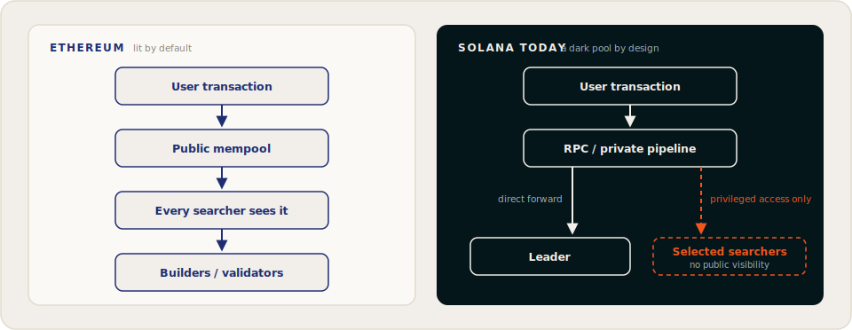

# Orderflow on Solana

**Orderflow** is the stream of pending user transactions (swaps, liquidations, transfers) before they are finalized on-chain. Whoever sees this stream first, and whoever controls the sequence in which it executes, controls real economic value: trading costs, MEV extraction, and inclusion quality all depend on it.

## How orderflow gets monetized

Across chains, three monetization models dominate:

### 1. Transaction landing fees

Users attach **priority fees** to compete for inclusion. On Solana this works like a *blind auction*: there is no public view of what others are paying, so users cannot assess the appropriate fee level and defensively overpay. The surplus flows to validators and infrastructure operators, not because block space was scarce, but because information was.

### 2. Market-maker access fees (PFOF)

Some venues route retail orderflow through exclusive channels in exchange for fee revenue, the on-chain equivalent of traditional finance's *payment for order flow*. The orderflow is monetized, but the user whose transaction created the value sees none of it.

### 3. Transaction ordering markets

Markets that sell the right to position transactions relative to others. These can be user-aligned (auctioning pure backrun rights, for example, where the user is unharmed) or exploitative (facilitating sandwich attacks and intentional delays).

Flowra's position: ordering markets are inevitable, so they should be **open, competitive, and user-protective** rather than closed and extractive.

## Ethereum vs. Solana: a structural difference

Chain | Pending transaction visibility | Consequence
--- | --- | ---
**Ethereum** | Public mempool; anyone can observe pending transactions | MEV competition happens in the open, and an entire open-auction ecosystem formed around it
**Solana** | No public mempool; Gulf Stream forwards transactions directly to upcoming leaders | Orderflow is only visible to the transaction pipeline operator: a de facto **dark pool**

Solana's Gulf Stream design is a core reason the chain is fast: skipping mempool gossip saves time and bandwidth. But it also means transparency has to be *engineered*. It does not exist by default.

## Where the value goes today

Because Solana's orderflow is dark, its value is captured in private:

- **Exclusive searcher relationships.** A searcher with private access to a stream keeps most of the MEV margin, tipping only what is necessary to land.
- **Private mempool deals.** After public mempool services were shut down in 2024 over sandwich-attack concerns, private mempools re-emerged among select validators: the same activity, less visibility.
- **Off-market arrangements.** Off-market orderflow deals spread, and dozens of validators lost Foundation delegation for participating in exploitative flows.

The lesson Flowra draws: **restriction did not remove the market, it removed the transparency.** The activity moved into channels where no one can measure or police it.

## Flowra's answer

Flowra converts the dark pool into a lit market:

- Participating validators route their flow through an **open pipeline**.
- Any searcher can subscribe to the standardized stream and bid in the open auction.
- Flow, published auction rules, and on-chain outcomes can be checked against each other, so harmful patterns can be detected and validator policies enforced rather than merely suspected.

For Flowra, this transparency is not primarily a market feature: it is what makes [policy-controlled, institutional-grade validation](institutional-validation.md) possible at all.

[!ref The problems this solves](the-problem.md)
