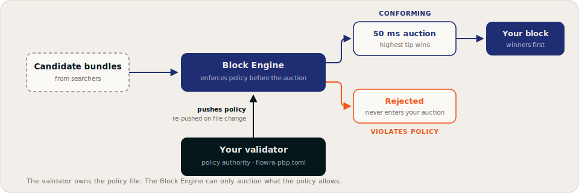

# Programmable Block Policy (PBP)

**Programmable Block Policy is Flowra's core feature.** It answers the question every institutional operator eventually asks and no existing pipeline can: *who decides what goes into my blocks?*

With PBP, the answer is the validator. You declare composition rules in a policy file that you own; the Flowra Block Engine can only auction and forward what your policy allows.

## The authority model



- **The validator is the policy authority.** Your policy lives in a TOML file on your machine, referenced by the `FLOWRA_PBP_CONFIG` environment variable.
- **The client pushes policy to the engine.** On connect, your validator client sends the policy to the Block Engine over the `ProvidePbpPolicy` RPC. Whenever the file changes, the client detects it and re-pushes automatically. No restart required.
- **The engine enforces before the auction.** Non-conforming bundles are filtered out before selection, so they never compete for your blocks in the first place.

## What you can express

Policy area | Config | Behavior
--- | --- | ---
**MEV posture** | `allow_aggressive_mev` | `false` blocks bundles matching the sandwich pattern (three or more transactions where the first and last share a fee payer wrapping a different one)
**Searcher allowlist** | `searcher_whitelist` | Empty means open to all searchers (the default); non-empty restricts your auction to listed pubkeys
**Address screening** | `address_blacklist` | Refuse bundles that reference listed addresses; lists can be derived from sanctions designations (e.g. OFAC SDN) and refreshed on your schedule
**Program filtering** | `program_blacklist` / `program_allowlist` | Deny bundles invoking listed programs, or require bundles to reference an allowlisted program. Deny always takes precedence over allow
**Priority designation** | `force_priority` | Bundles from designated searchers are pinned to the top of the block
**Category quotas** | `category_quotas` | Cap the share of block compute units available to a category of programs (name, percentage, program IDs)

!!!info Scope
PBP is deterministic, address- and structure-level screening at auction time, designed to fit Solana's 400&nbsp;ms slot budget. It gives compliance programs something no off-chain process can: enforcement *before* inclusion.
!!!

## Example policy

```toml
# flowra-pbp.toml
[policy]
allow_aggressive_mev = false   # block sandwich-pattern bundles

[searcher_whitelist]
pubkeys = []                   # empty = permissionless (default)

[address_blacklist]
addresses = [                  # operator-managed screening list
  # "<base58-address>",
]

[program_blacklist]
program_ids = []

[program_allowlist]
program_ids = []               # non-empty = bundles must reference one

[force_priority]
searchers = []                 # pinned to the top of the block

[[category_quotas]]
name = "amm"
pct = 40                       # max 40% of block CU budget
program_ids = ["<amm-program-id>"]
```

Omitting the file entirely runs the default policy: open access, standard inclusion, no filters.

## Operational behavior

- **Hot reload.** Edit the file and save; the client re-pushes the policy on the next heartbeat. The engine also refreshes its own local policy file every two seconds.
- **Logged enforcement.** Policy pushes and rejections are visible in client and engine logs, giving operators a local record of what was enforced and when.
- **Independent of liveness.** Policy applies to auction bundles only. If the Block Engine is unreachable, your validator builds blocks locally and nothing about your block production depends on the policy path. See [Architecture](architecture.md#failure-behavior-the-validator-never-depends-on-flowra).

## Reporting (planned)

On the [roadmap](../resources/roadmap.md#phase-4-institutional-expansion-q4-2026-and-beyond), Flowra adds a **policy reporting suite**: signed auction records plus packaged enforcement reports that combine your declared policy, engine decisions, and on-chain outcomes into a single document for risk teams, delegators, and reviewers.

[!ref Why openness makes this checkable](open-orderflow-auction.md)
[!ref Configure PBP on your validator](../validators/configuration.md)
