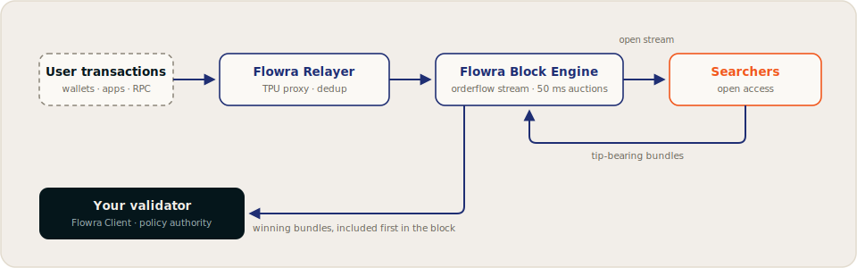

# Flowra Documentation

Flowra is **institutional-grade validator infrastructure for Solana**, built on two commitments:

1. **Control.** Validators define exactly what is allowed into their blocks through the [Programmable Block Policy (PBP)](concepts/programmable-block-policy.md): sanctions screening, denylists, MEV posture, priority rules.
2. **Accountability.** Those policies are enforceable and checkable, not promised. Flowra runs an **Open Orderflow Auction (OOA)**: pending transactions are streamed openly and bundle competition happens in transparent 50&nbsp;ms auctions, so enforcement can be verified rather than taken on faith.

Open competition also raises tips and validator returns. The product is accountable block production; better economics come with it.

!!!info Network status
Flowra is currently rolling out toward mainnet. Endpoints, on-chain program addresses, and client releases are published on this site as they go live. Values marked [!badge variant="warning" text="TBD"] are not yet final; see the [Roadmap](resources/roadmap.md) for the current phase.
!!!

## Start here

[!ref icon="verified" text="What institutional-grade validation means"](concepts/institutional-validation.md)
[!ref icon="shield-check" text="Programmable Block Policy"](concepts/programmable-block-policy.md)
[!ref icon="server" text="Run a Flowra validator"](validators/index.md)
[!ref icon="zap" text="Build as a searcher"](searchers/index.md)

## Choose your path

Participant | What Flowra offers | Where to start
--- | --- | ---
**Institutions** | Compliance-grade block composition: sanctions and denylist screening, program filters, and custom restrictions enforced at the infrastructure layer | [Institutional-Grade Validation →](concepts/institutional-validation.md)
**Validators** | Policy-level control over your blocks via [PBP](concepts/programmable-block-policy.md), operational independence, and additional revenue from open bundle competition | [Validators →](validators/index.md)
**Searchers** | Permissionless access to a standardized orderflow stream and open, tip-based auctions every 50&nbsp;ms | [Searchers →](searchers/index.md)
**Users & traders** | Real-time fee visibility, competitive pressure that pushes fees toward fair levels, and enforceable validator policies against sandwiching | [FAQ →](resources/faq.md)

## How it works, in one minute

1. User transactions arrive at the **Flowra Relayer**, which fronts the validator's TPU and deduplicates the flow.
2. The **Block Engine** broadcasts the flow to searchers over a standardized gRPC stream.
3. Searchers submit tip-bearing bundles into 50&nbsp;ms auction cycles.
4. The Block Engine simulates the bundles, drops any that revert, and selects the highest-tipping, non-conflicting set, subject to the validator's [block policy](concepts/programmable-block-policy.md).
5. Winning bundles are forwarded to the leader and included first in the block.

[!ref See the full architecture](concepts/architecture.md)

## Why open the orderflow?

Solana has no public mempool. Pending transactions flow directly to leaders, so orderflow lives in private channels, and everything downstream of that is unverifiable: users cannot see fair fee levels, sandwich activity cannot be measured, and a validator claiming "we enforce policy X" is asking to be taken on faith.

**A policy you cannot check is a promise, not a control.** Flowra opens the flow so that enforcement becomes checkable. Openness is the accountability mechanism; the revenue uplift from competition is the bonus.

[!ref Read about the problem Flowra solves](concepts/the-problem.md)

## Get in touch

- Website: [flowra.wtf](https://flowra.wtf)
- Blog: [flowra.wtf/blog](https://flowra.wtf/blog)
- Email: [info@flowra.wtf](mailto:info@flowra.wtf)
