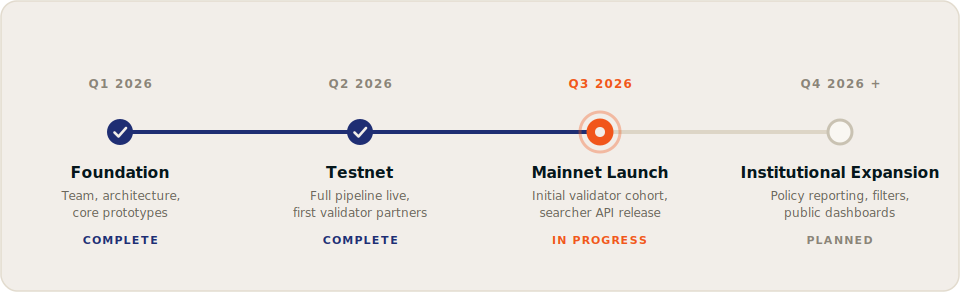

# Roadmap

Flowra ships in four phases, from core infrastructure to a fully institution-ready orderflow market.

## Phase 1: Foundation (Q1 2026) [!badge variant="success" text="Complete"]

- Core team assembly and system architecture design
- Pre-seed funding
- Core prototypes: Flowra Validator Client, Relayer, and Block Engine

## Phase 2: Testnet (Q2 2026) [!badge variant="success" text="Complete"]

- Testnet launch of the full pipeline (Relayer, Block Engine, Validator Client)
- Orderflow streaming infrastructure hardening
- Initial validator partnerships (~20M SOL of committed stake)

## Phase 3: Mainnet Launch (Q3 2026) [!badge variant="info" text="In progress"]

- Mainnet launch with the initial validator cohort
- Public searcher API release (auth, stream subscriptions, bundle submission)
- [Programmable Block Policy](../concepts/programmable-block-policy.md) core policy set live
- Publication of endpoints and on-chain program addresses, tracked on [Endpoints & addresses](../validators/endpoints.md)

## Phase 4: Institutional Expansion (Q4 2026 and beyond) [!badge text="Planned"]

- Validator network expansion beyond the initial cohort
- **Policy reporting suite**: packaged enforcement reports for operators, delegators, and reviewers
- **Auction record publication**: signed selection records so third parties can reconcile stream, auction, and blocks
- **Filter-enforced subscriptions**: mandatory concrete filters on orderflow subscriptions as an additional anti-spam layer
- Public dashboards for auction stats and tip levels
- Delegation integrations for funds and staking providers

!!!info
Dates reflect current planning and may shift with network conditions. Follow [flowra.wtf/blog](https://flowra.wtf/blog) for launch announcements.
!!!
