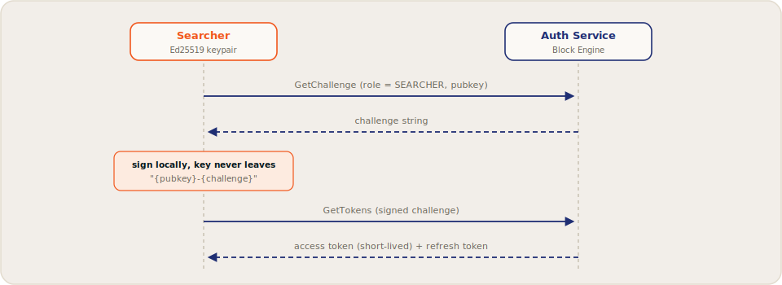

# Getting Started

Searcher access is **permissionless**: there is no application review or allowlist by default. You authenticate with a keypair, subscribe to the stream, and start bidding.

## Prerequisites

- An **Ed25519 keypair** (a standard Solana keypair works) to identify your searcher.
- A gRPC client stack in your language of choice.
- SOL for tips on the network you target (testnet first; see [endpoints](../validators/endpoints.md#testnet)).

## Authentication flow

Flowra uses challenge-response authentication with JWT tokens. Your private key never leaves your machine.



>>> Request a challenge

Call `AuthService.GenerateAuthChallenge` with your role and pubkey:

```text
GenerateAuthChallengeRequest {
  role: SEARCHER
  pubkey: <32-byte pubkey>
}
```

>>> Sign the challenge

Sign the exact string `"{pubkey}-{challenge}"` with your Ed25519 private key, where `{pubkey}` is your base58 identity and `{challenge}` is the returned token.

>>> Exchange for tokens

Call `GenerateAuthTokens` with the challenge, your pubkey, and the 64-byte signature. You receive an **access token** (short TTL, attach as gRPC bearer metadata on every call) and a **refresh token** (longer TTL). Renew access tokens with `RefreshAccessToken` instead of re-signing.

>>>

## Proto files

The gRPC surface is defined in Flowra's `mev-protos` [!badge variant="warning" text="Public repo TBD"], compatible with the widely used Jito proto layout:

File | Contents
--- | ---
`auth.proto` | Challenge and token authentication (`AuthService`)
`searcher.proto` | `SearcherService`: bundle submission, results, leaders, regions, tip accounts
`bundle.proto` | Bundle structure and the full `BundleResult` state machine
`block_engine.proto` | Validator- and relayer-facing services, including the PBP policy RPC
`packet.proto` / `shared.proto` | Transaction packet format and common types

The protos compile cleanly with standard `tonic`, `grpc-js`, and `grpcio` toolchains.

## First session

With an access token in hand, a minimal loop looks like:

1. `GetTipAccounts` to learn where tips go.
2. `SubscribePendingTransactions` to open the orderflow stream ([details](orderflow-stream.md)).
3. `GetNextScheduledLeader` to see when a Flowra validator is next on rotation.
4. Build a bundle around an opportunity and `SendBundle` ([details](bundles.md)).
5. Watch `SubscribeBundleResults` for the outcome, and calibrate your next bid.

## If you have integrated bundle pipelines before

The concepts map directly: bundles, tips, atomic execution, auth via challenge-response, results streaming. Differences worth noting:

- **The orderflow stream is part of the product.** You subscribe to pending transactions rather than relying on your own flow sources.
- **Tips are auction bids** settled every 50&nbsp;ms, with a 5% protocol fee.
- **Access is open by default**: a validator can restrict its auction via policy, but the network-level default is permissionless.

[!ref Next: subscribing to the stream](orderflow-stream.md)
