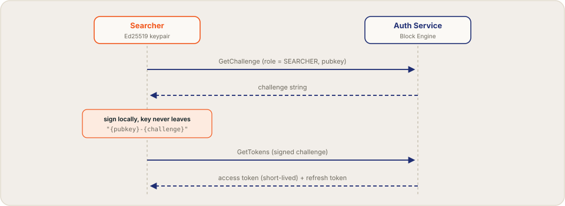

# Getting Started

Searcher access is **open**: anyone can sign up, register a key, and start bidding once the key is approved. Registration exists so that the network can hold a key accountable — a key that sandwiches users loses its mempool access, not the whole network.

## Prerequisites

- An **Ed25519 keypair** (a standard Solana keypair works). This one key is your identity: it proves ownership at registration, authenticates you to the Block Engine, and is the fee payer the engine attributes your bundles to.
- A gRPC client stack in your language of choice.
- SOL for tips on mainnet. There is no separate public testnet; use the [dry run](bundles.md#dry-run) to test without spending.

## Registering your key

>>> Create an account

Sign up at [portal.flowra.wtf](https://portal.flowra.wtf) with an email and password (12+ characters), or continue with Google or GitHub. Email sign-ups receive a verification link.

>>> Prove you own the key

The portal never sees your private key. It shows you the message

```text
flowra-register:{your email}:{your pubkey}
```

and asks for an Ed25519 signature of exactly that string (base58). Two ways to produce it:

- **With a wallet**: Phantom, Solflare, Backpack, or MetaMask with a Solana account — the portal detects the wallet, connects, and asks it to sign. The wallet's key becomes your searcher key, so this only makes sense if your bot signs with that same key.
- **With a keypair file**: the portal shows Rust, JavaScript, and Python snippets that sign the message with your `searcher.json`.

Paste the signature, add a name and a one-line purpose, and submit.

>>> Wait for approval

Keys are reviewed by the Flowra operators. Until a key is approved, `GenerateAuthChallenge` answers `PERMISSION_DENIED: Searcher key is pending`. Approved keys show their status, mempool scope, and bundle limit on the portal.

>>>

Each key carries three operator-set attributes you can read on the portal:

Attribute | Meaning
--- | ---
Mempool scope | **Full**: every pending transaction. **Leader scope**: transactions only while one of the validators in your scope is about to lead (within the next 8 slots).
Bundle limit | Maximum `SendBundle` calls per second for this key (default 20). Exceeding it returns `RESOURCE_EXHAUSTED`.
Enforcement level | L0 normal · L1 warning · L2 submission limited · L3 mempool stream withheld · L4 suspended. Levels are raised automatically by network rules (a detected sandwich goes straight to L3) and lowered by an operator. See [Bundles](bundles.md#what-gets-you-throttled).

## Authentication flow

Flowra uses challenge-response authentication with JWT tokens. Your private key never leaves your machine.



>>> Request a challenge

Call `AuthService.GenerateAuthChallenge` with your role and pubkey:

```text
GenerateAuthChallengeRequest {
  role: SEARCHER
  pubkey: <32-byte pubkey>
}
```

>>> Sign the challenge

Sign the exact string `"{pubkey}-{challenge}"` with your Ed25519 private key, where `{pubkey}` is your base58 identity and `{challenge}` is the returned token.

>>> Exchange for tokens

Call `GenerateAuthTokens` with the challenge, your pubkey, and the 64-byte signature. You receive an **access token** (valid 1 hour) and a **refresh token** (valid 24 hours). Attach the access token as gRPC metadata on every call:

```text
authorization: Bearer <access token>
```

Renew with `RefreshAccessToken` before the access token expires instead of re-signing. Tokens survive engine restarts.

>>>

`AuthService` is served on the standalone auth port of your region (`8005`); `SearcherService` is on `8234`. Both are plain gRPC over HTTP/2 without TLS — use `http://`, not `https://`, in your channel URL. See [endpoints](../validators/endpoints.md).

## Proto files

The gRPC surface is defined in [`flowrawtf/mev-protos`](https://github.com/flowrawtf/mev-protos), a fork of the Jito proto layout with Flowra extensions marked `FLOWRA EXTENSION` inline:

File | Contents
--- | ---
`auth.proto` | Challenge and token authentication (`AuthService`)
`searcher.proto` | `SearcherService`: stream subscription, bundle submission (+ dry run), results, leaders, tip accounts
`bundle.proto` | Bundle structure, `BundleResult` states, and the simulation report types
`block_engine.proto` | Validator- and relayer-facing services, including the PBP policy RPC
`packet.proto` / `shared.proto` | Transaction packet format and common types

The protos compile cleanly with standard `tonic`, `grpc-js`, and `grpcio` toolchains, and existing Jito searcher clients work against Flowra after pointing them at a Flowra endpoint.

## First session

With an access token in hand, a minimal loop looks like:

1. `GetTipAccounts` to learn where tips go.
2. `SubscribePendingTransactions` to open the orderflow stream, optionally with the accounts you trade ([details](orderflow-stream.md)).
3. `GetNextScheduledLeader` to see when a Flowra validator is next on rotation.
4. Build a bundle around an opportunity, check it with `simulate_only`, then `SendBundle` for real ([details](bundles.md)).
5. Watch `SubscribeBundleResults` for the outcome, and calibrate your next bid.

## If you have integrated Jito before

The concepts map directly: bundles, tips, atomic execution, auth via challenge-response, results streaming, the same proto shapes. Differences worth noting:

- **The orderflow stream is part of the product.** You subscribe to pending transactions from the same interface you submit to.
- **Keys are registered.** One-time registration on the portal, then the same auth flow you already run.
- **Tips are auction bids** settled every 10&nbsp;ms, with a 5% protocol fee.
- **Dry runs are free.** `simulate_only` returns the full simulation report without entering the auction.
- **Sandwiching is a policy decision, not a given.** Each validator decides through its [block policy](../concepts/programmable-block-policy.md); where it is disallowed the engine rejects the bundle and the network raises your key's enforcement level.

[!ref Next: subscribing to the stream](orderflow-stream.md)
