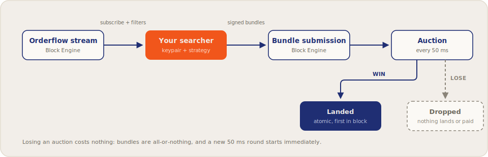

# Searchers

Flowra gives searchers what Solana has never had: **permissionless, standardized access to orderflow**. No privileged relationships, no private deals. Subscribe to the stream, find your edge, and win by bidding.

## What you get

### An open, standardized stream

Pending transactions from all participating validators, deduplicated and delivered over a single gRPC interface. One integration covers the whole Flowra validator set. See [Orderflow Stream](orderflow-stream.md).

### Auctions every 50 ms

Mini-auctions close every 50&nbsp;ms, up to eight rounds per Solana slot. Within a window, the highest tip wins among non-conflicting bundles; you are racing bids, not nanoseconds. Mechanics: [Auction Mechanics](../concepts/auction-mechanics.md).

### Atomic, all-or-nothing bundles

Bundles execute in order and in full, or not at all. Failed bundles never land, so multi-leg strategies carry no partial-execution risk and no wasted fees on reverts. See [Bundles](bundles.md).

### Strategy confidentiality

The *orderflow* is open; your *bundles* are not. Submissions go point-to-point to the Block Engine and are never exposed to other searchers or a public mempool.

### Simple economics

The protocol fee is **5% of tips**. No subscriptions, no per-seat access fees, no paid data tiers.

## How it fits together

## Requirements

Requirement | Detail
--- | ---
Keypair | An Ed25519 keypair identifying your searcher (used in authentication)
Connectivity | gRPC/TLS to your nearest Flowra region ([endpoints](../validators/endpoints.md))
Tips | SOL for auction tips, paid as lamport transfers to tip accounts (`GetTipAccounts`)
Bundle size | Up to 5 transactions per bundle

## Guides

[!ref icon="rocket" text="Getting started & authentication"](getting-started.md)
[!ref icon="broadcast" text="Subscribing to the orderflow stream"](orderflow-stream.md)
[!ref icon="package" text="Building and submitting bundles"](bundles.md)
[!ref icon="code" text="API reference"](api-reference.md)
